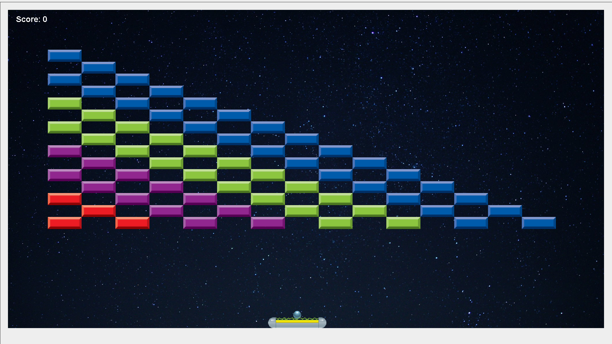
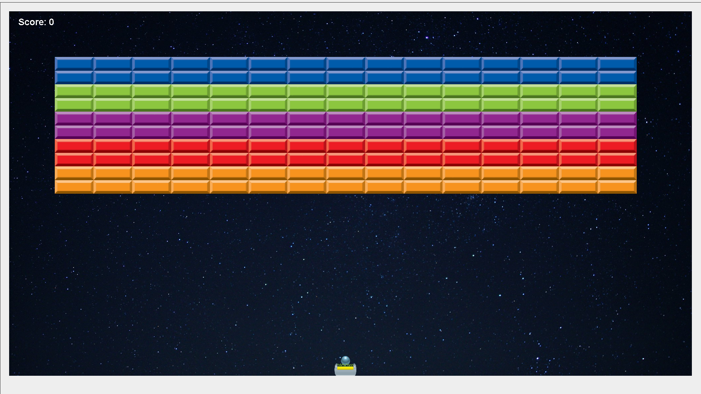

# Arkanoid
### Summer 2020

It is a source code of an arcade 2D game for Windows written in Java using Swing and Model-View-Controller pattern.
Press F1 while playing to get more information how to play.

